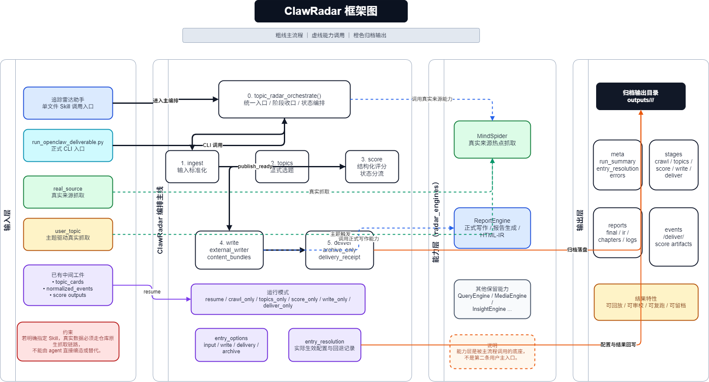

# ClawRadar

面向真实来源热点发现、结构化评分、内容生成与归档交付的开源舆情流水线。

当前仓库分成两层：

- `clawradar/`：顶层统一编排主线，负责入口、契约、测试和正式 launcher。
- `radar_engines/`：当前保留的能力层，现阶段完整保留 `MindSpider`、`QueryEngine`、`MediaEngine`、`ReportEngine` 四个引擎，以及它们依赖的共享基础设施。

这轮改造的目标是先剥掉旧平台外壳，再讨论四个引擎内部如何继续瘦身。现在不做四引擎内部裁剪。

## 项目概览

ClawRadar 试图把“舆情发现 -> 证据组织 -> 评分决策 -> 写作产出 -> 归档交付”收敛到同一条可复用链路里。它既可以作为独立命令行流程运行，也可以作为上层系统调用的协议化组件使用。



当前顶层实现强调四点：

- 统一入口，而不是分散脚本
- 结构化中间产物，而不是仅返回文本
- 可归档、可回放、可审计的运行结果
- 与 `radar_engines/` 能力层复用，而不是重复造轮子

## 当前入口

顶层主入口是：

```python
from clawradar.orchestrator import topic_radar_orchestrate
```

围绕这个入口，项目已经具备这些能力：

- 输入适配：`inline_candidates`、`inline_normalized`、`inline_topic_cards`、`real_source`、`user_topic`
- 标准化 ingest：收敛为统一的 `normalized_events`
- 选题与抓取桥接：支持真实来源加载，也支持从用户主题派生抓取请求
- 结构化评分：生成时间线、事实点、风险标记、维度分和最终决策
- 写作阶段：支持内置写作，也支持委托 `ReportEngine` 作为外部 writer
- 交付阶段：支持飞书消息格式和本地归档快照
- 编排与产物管理：每次运行都会生成 `meta/`、`stages/`、`events/` 等输出目录

## 仓库结构

```text
ClawRadar/
├─ clawradar/                   # 顶层工作流主线
│  ├─ contracts.py              # ingest 契约与标准化
│  ├─ topics.py                 # 选题卡片、user_topic 适配
│  ├─ real_source.py            # real_source 适配
│  ├─ scoring.py                # 评分与决策
│  ├─ writing.py                # 写作与外部 writer 适配
│  ├─ delivery.py               # 交付与归档
│  └─ orchestrator.py           # 统一编排入口
├─ run_openclaw_deliverable.py  # 正式推荐 launcher
├─ scripts/
│  └─ run_real_source_demo.py   # real_source 演示脚本
├─ tests/                       # 顶层主线测试
├─ radar_engines/               # 当前保留的能力层
│  ├─ MindSpider/               # 热点采集与深爬能力
│  ├─ QueryEngine/              # 通用搜索能力
│  ├─ MediaEngine/              # 多模态搜索能力
│  ├─ ReportEngine/             # 报告生成与渲染能力
│  ├─ static/                   # ReportEngine 仍在使用的静态资源
│  ├─ utils/                    # 共享工具
│  └─ config.py                 # 共享配置入口
├─ clawradar-skill/             # 单文件 Skill 的仓库内维护目录
└─ outputs/                     # 运行输出目录
```

## `radar_engines` 当前边界

当前策略是保留四个引擎整体，不做内部子功能裁剪。

保留的引擎：

- `MindSpider`
- `QueryEngine`
- `MediaEngine`
- `ReportEngine`

当前仍需保留的共享基础设施：

- `radar_engines/config.py`
- `radar_engines/utils/`
- `radar_engines/static/`

已经删除的旧平台外壳包括：`ForumEngine`、`InsightEngine`、`SingleEngineApp`、`SentimentAnalysisModel`、旧的 Streamlit 报告目录、旧测试目录和旧入口脚本。

## 主流程

`topic_radar_orchestrate()` 负责主链路串联：

1. 接收输入并解析 `entry_options`
2. 根据输入模式决定是否走 `real_source` / `user_topic` 适配
3. 生成候选事件并做 ingest 标准化
4. 对候选事件进行评分，得到 `publish_ready`、`watchlist`、`need_more_evidence` 等结论
5. 对可发布事件生成内容包
6. 执行交付或归档
7. 输出统一的 `run_summary`、阶段状态和事件状态

正式 launcher 默认策略：

- `write.executor = external_writer`
- `delivery.target_mode = archive_only`
- `delivery.target = archive://clawradar`
- `degrade.* = fail`

这意味着它优先走正式交付路径，但不会默认直接向外部渠道推送。

## 快速开始

### 环境建议

仓库顶层代码使用 Python 3.10+ 语法，建议使用 Python 3.10 或 3.11。

如果你只想跑顶层契约测试，最小依赖很少；如果你要启用 `real_source`、外部写作或完整引擎能力，建议安装项目根目录 `requirements.txt` 中的依赖。

```bash
python -m venv .venv
.venv\Scripts\activate
pip install -r requirements.txt
pip install pytest
```

### 最小 Python 调用

```python
from clawradar.orchestrator import topic_radar_orchestrate

payload = {
    "request_id": "req-minimal-001",
    "trigger_source": "manual",
    "topic_candidates": [
        {
            "event_id": "evt-minimal-001",
            "event_title": "OpenAI 发布企业级智能体平台更新",
            "event_time": "2026-04-09T08:00:00Z",
            "source_url": "https://example.com/openai-update"
        }
    ]
}

result = topic_radar_orchestrate(payload)
print(result["run_status"], result["final_stage"], result["decision_status"])
```

### 正式 launcher

```bash
python run_openclaw_deliverable.py --input-mode real_source --source-ids weibo --limit 5
python run_openclaw_deliverable.py --input-mode user_topic --topic "AI 智能体治理" --company "OpenAI" --keywords 治理 审计
```

### real_source 演示

```bash
python scripts/run_real_source_demo.py
```

这个脚本会关闭写作和交付，只保留真实来源加载和评分，便于本地验证输入适配链路。

## 输入模式

当前最重要的外部输入模式：

- `real_source`：从 `MindSpider` 等真实来源拉取热点候选事件，再进入统一主链路。
- `user_topic`：用户只给主题、公司、关键词等提示词，系统先构造主题上下文，再委托真实来源层做候选发现。

此外也支持直接给：

- `topic_candidates`
- `normalized_events`
- `topic_cards`

这使得项目既可以作为完整流水线运行，也可以作为中间协议层嵌入其他系统。

## 输出结果

一次运行通常会在 `outputs/<request_id>/<run_slug>/` 下生成结果。典型目录包括：

- `meta/`：`run_summary.json`、`entry_resolution.json`、`artifact_summary.json`、`errors.json`
- `stages/`：各阶段的中间结果快照
- `events/`：按事件维度归档的评分卡、payload 快照、交付产物
- `reports/`：最终报告、IR、中间章节和日志

## 测试

```bash
python -m pytest tests
```

当前顶层主线重点验证的是：

- 统一入口的行为一致性
- `publish_ready` / `need_more_evidence` 等状态路由
- 写作与交付阶段的协议稳定性
- 归档产物是否完整落盘

## 适合从哪里开始读

如果你第一次接手这个项目，推荐按下面顺序阅读：

1. `run_openclaw_deliverable.py`
2. `clawradar/orchestrator.py`
3. `clawradar/contracts.py`
4. `clawradar/scoring.py`
5. `clawradar/writing.py`
6. `clawradar/delivery.py`
7. `tests/test_clawradar_automation.py`

## 注意事项

- 当前仓库里同时保留了顶层编排和遗留能力层，阅读时不要把 `clawradar/` 和 `radar_engines/` 当成两套并列入口。
- `real_source` 和 `external_writer` 目前仍依赖 `radar_engines/` 中的模块以及对应运行环境。
- `ReportEngine` 内部仍保留少量对已删除旧模块的兼容引用，这些属于后续清理对象，不影响当前“四引擎整体保留”的边界。

## 开源协议

本仓库根目录已采用 [GPL-2.0](./LICENSE) 开源协议。

如果你后续准备拆分子模块、二次分发或引入新的第三方组件，仍然建议逐目录核对相关许可证文件。
