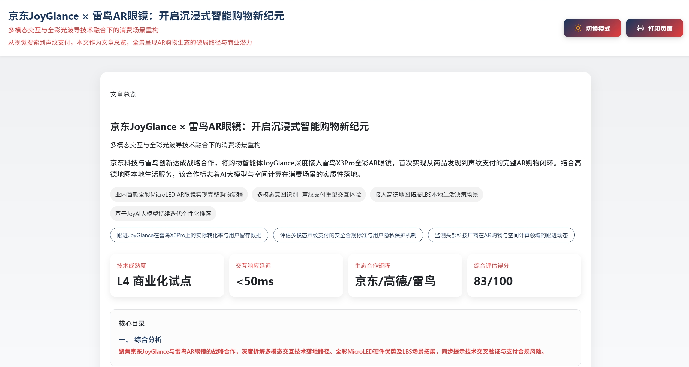

# 【香山东小东】ClawRadar：从热点发现到内容交付

> ClawRadar 不是“给我一个主题，直接吐一篇稿子”的生成工具，而是一条更接近真实编辑部工作方式的内容工作流：先发现热点、补证据、做判断，再决定是否进入写作与交付。

---

## 一、项目背景：为什么我不想再做一个“直接写稿”的 AI

做 AI、科技、商业热点内容时，最耗时间的往往不是最后那一步写作，而是前面的这些编辑劳动。每天都有大量新信息冒出来，真正困难的是从混杂的链接、平台帖子、新闻快讯和用户话题里筛出值得跟进的信号；更困难的是，当一个话题看起来“好像能写”时，还要继续判断它究竟只是短暂噪声，还是已经具备足够的信息密度与传播价值。再往后，还要把零散材料整理成时间线、事实点和证据包，最后才能进入“写什么、怎么写、以什么角度写”的阶段。

很多 AI 内容工具的问题在于，它们默认所有输入都值得直接生成。于是弱信号被放大成正式内容，单一来源被误当作可靠事实，最后出来的文本表面完整，实际却并不可信。也正是因为看到了这一点，我想做的就不是一个“更会生成”的 AI，而是一条更接近真实内容生产流程的工作链路：让 AI 先做选题判断，再做内容生成。

---

## 二、项目定位：ClawRadar 到底在解决什么问题

我把 ClawRadar 定义为一个面向真实来源热点发现、结构化评分、内容生成与归档交付的开源内容工作流。它要解决的不是“能不能写出一篇文章”，而是内容系统在进入写作之前，能不能先完成一套更接近真实编辑判断的流程。

### 2.1 先把零散信号变成结构化事件

系统不以“一个链接”或“一段摘要”作为最终输入，而是先把候选内容统一整理成可消费的事件对象，例如 `event_id`、`event_title`、`event_time` 和 `source_url` 这样的基础字段。这样做的意义在于，后续判断、评分、写作和交付都建立在同一套稳定的数据底座之上，而不是继续围绕零散文本做临时拼接。

### 2.2 先建立判断机制，再决定值不值得写

不是所有热点都值得写，更不是所有热度都应该被放大成正式稿件。所以系统在评分后会明确给出结论状态，而不是默认一路写下去。当前主线里已经支持 `publish_ready`、`need_more_evidence`、`watchlist` 和 `no_publish` 这些结果状态。这个设计其实是整个项目最重要的部分，因为它决定了这到底是一个“负责任的内容系统”，还是一个“会生成文字的玩具”。

### 2.3 只让真正通过门槛的话题进入写作与交付

当一个事件通过判断后，系统才继续组织时间线、事实点、风险标记、评分卡、标题、提纲、摘要、正文草稿以及交付回执和本地留档。最终交付的不是一句回复，而是一整套可审校、可回放、可复跑的内容产物。换句话说，它的目标从来不是“帮我写一段”，而是“帮我跑完一条可靠的工作流”。

---

## 三、当前项目状态：哪些能力已经真正落地

从当前仓库的真实状态来看，ClawRadar 已经不是一个停留在概念层面的原型。现在整个主流程已经统一收口到 `topic_radar_orchestrate()` 这个入口上，正式命令行入口则是仓库根目录下的 `run_clawradar_deliverable.py`。围绕这条主线，当前系统已经具备一条相对完整的内容工作流骨架。

### 3.1 输入侧：真实来源驱动与主题驱动都已成立

系统当前重点支持两类外部输入。一类是 `real_source`，也就是从真实来源抓取候选热点，再进入统一主链路；另一类是 `user_topic`，也就是从用户给定的主题、公司、关键词等提示出发，触发真实抓取，再进入后续判断与写作流程。这意味着它既支持“自动扫热点”，也支持“编辑主动选题”，而不是只支持单一入口。

### 3.2 流程侧：已经形成显式阶段，而不是黑箱生成链

当前主链路已经拆成了 `crawl`、`topics`、`score`、`write` 和 `deliver` 这几个明确阶段，并且支持 `full_pipeline`、`crawl_only`、`topics_only`、`score_only`、`write_only`、`deliver_only` 和 `resume` 这些执行模式。也就是说，它不仅能一路跑到底，也能在已有中间工件的基础上继续执行，把一次运行从头到尾拆成真正可复用、可调试、可审查的工作段。

### 3.3 判断侧：结构化评分与状态分流已经成立

在评分阶段，系统会组织并输出 `timeline`、`fact_points`、`risk_flags` 和 `scorecard`，并围绕时效性、证据强度、新颖性、业务相关性和写作就绪度这几个维度给出明确状态。这一步的意义非常大，因为很多系统的问题从来不是写不出来，而是明明不该写的时候也照样会写。ClawRadar 允许系统明确说出“证据还不够”“暂时先观察”“现在还不值得发”，这看起来像是减少了生成次数，但实际上是在提高整个链路的可信度。

### 3.4 写作与交付侧：正式默认链路已经收口

对通过门槛的事件，系统会继续生成 `content_bundles`、写作回执 `writer_receipts` 和交付回执 `delivery_receipt`。当前正式默认配置已经收口为 `write.executor = external_writer`、`delivery.target_mode = archive_only`、`delivery.target = archive://clawradar`。这意味着当前主线强调的是接入真实写作能力，并把结果可追溯地留存在本地，而不是直接对外分发。

### 3.5 输出侧：可回放、可复核的输出目录已经固定

系统每次运行都会在仓库根目录下生成统一输出，也就是 `outputs/<request_id>/<run_slug>/`。这个 run 目录下包含 `meta/`、`stages/`、`reports/` 和 `events/` 四类关键内容：`meta/` 里是本次运行的整体信息，`stages/` 里是各阶段工件快照，`reports/` 里是写作侧产物，`events/` 里则保留了按事件归档的交付快照。这一层设计的重要性在于，它让一次运行不再是“结果看完就算结束”，而是真正变成可回看、可复查、可比较、可复跑的工程对象。

---

## 四、架构思路：不是堆 Prompt，而是在做工作流

从架构层面看，ClawRadar 也不是简单把所有能力塞进一个包里。当前仓库里，`clawradar/` 负责主工作流、判断逻辑、状态分流和结果收口，而 `radar_engines/` 则作为被复用的能力底座存在，例如真实来源采集能力和报告写作能力都来自这里。

### 4.1 `clawradar/` 负责主系统收口

我刻意守住了一条很重要的边界：ClawRadar 是主系统，`radar_engines/` 是能力层。也就是说，这个项目不是一个“大而全的舆情平台”，也不是一个“无人审校自动发稿系统”，而是一条单机、受控环境下的正式内容工作流主线。这个边界看起来像是在克制项目规模，但我认为它恰恰构成了项目的成熟度。

### 4.2 `radar_engines/` 负责被复用的能力底座

`radar_engines/` 里保留的是被主线复用的底层能力，例如真实来源抓取、报告写作、既有分析能力等。它不是被拿来当成另一个最终用户入口，而是作为能力供应层存在。这种划分让系统不会随着能力增加而变得越来越散，也避免了“为了展示所有模块而展示所有模块”的失控扩张。

---

## 五、追踪雷达助手：把工作流封装成可调用 Skill

在当前项目里，我还把这条主线进一步收口成了一个单文件 Skill，也就是“追踪雷达助手”。它不是新的一套平行编排，而只是对现有工作流的调用封装，让上层调用时有一个稳定、低歧义的边界。

### 5.1 它为什么重要

这个 Skill 的意义，不是为了“再多一个入口”，而是为了让外层调用明确知道：它调的是一条真实工作流，而不是一段自由发挥的 agent 对话。它的存在让“调用方式”和“工程约束”被写进了仓库本身，而不是只存在于人的口头约定中。

### 5.2 我特别强调的一条硬约束

这里我加了一条我认为必须反复强调的规则：如果用户明确要求使用“追踪雷达助手”，那么真实数据必须由仓库自己的 `real_source` 或 `user_topic -> real_source` 链路抓取，而不能先由 agent 自己手工搜索、整理，再把结果包装成看起来像 Skill 输出的中间工件。这不是一句形式化约束，而是整个项目可信度的底线。因为一旦真实来源被手工代抓，系统就不再是一个工作流，而又会退回到“搜点资料再写一段”的演示状态。

---

## 六、项目特点

如果要概括这个项目当前最值得强调的地方，我会认为它真正做对了几件事。

### 6.1 它把“判断”放在了“生成”前面

很多内容类 AI 工具默认所有输入都值得生成，ClawRadar 则反过来，先判断这是不是一个值得进入正式写作的题。这听上去像是在给系统增加门槛，但实际上这是让系统真正具备内容责任感的关键一步。

### 6.2 它让结构化工件贯穿了全链路

从输入、评分到交付，系统都在产出结构化工件，而不是靠自由文本串联。这带来的价值非常直接：可追溯、可调试、可复跑、可审校。对真实内容工作来说，这比“多写出一段漂亮文字”更有长期价值。

### 6.3 它允许“不出稿”

这是一个很小但很关键的设计。在很多真实场景里，最有价值的结论恰恰是“现在还不值得写”“证据还不够”“应该继续观察”。系统允许输出 `watchlist` 和 `need_more_evidence`，而不是为了“显得聪明”去硬写一篇弱稿。我认为这是这个项目和很多生成型 Demo 最大的区别之一。

### 6.4 它同时支持真实来源驱动和主题驱动

它既能从真实来源抓热点，也能从用户主题出发组织候选发现。所以它既适合“自动巡检”，也适合“编辑主动策划”。这让它不只是一个自动扫描器，而更像一个内容中枢。

### 6.5 它的最终结果不是回复，而是交付链路

最终结果不是一段聊天回复，而是一整套可归档、可追溯、可继续执行的产物。这让它更像一个内容工作中枢，而不是一次性生成器。

---

## 七、当前边界：我没有把它写成一个“大而全平台”

我也刻意没有把这个项目写成一个“什么都能做”的平台。当前它的真实边界非常清楚：它不是完整舆情平台，不是自动发稿平台，也不是无人审校内容系统。它聚焦的始终是“热点发现、判断分流、内容组织与归档交付”这一条主工作流。

我认为这反而是一个优点。因为比赛里最容易失分的，往往不是“做得少”，而是“概念太大、边界不清、最后所有能力都只停留在描述层”。ClawRadar 现在的优势就在于，它不是泛化地说“我也能做舆情平台”，而是明确地说“我把一条最关键的内容工作流真正工程化地打通了”。

---

## 八、总结

如果最后再用一句话总结这个项目，我会这样说：ClawRadar 想解决的，不是“AI 会不会写”，而是“AI 能不能像一个认真负责的编辑流程那样，先判断，再生成，再交付”。它把热点发现、证据整理、选题评分、内容生成与归档交付，真正收口到了一条统一工作流里。

ClawRadar，不是一个“会生成文章”的工具，而是一个更接近真实生产场景的内容系统原型。它知道什么时候该继续，也知道什么时候该停下；它不只输出文本，还输出结构、证据、状态和回执。这也是我理解的 AI 内容生产下一步应该去的方向：不是更快地写，而是更可靠地判断，再更稳地交付。
