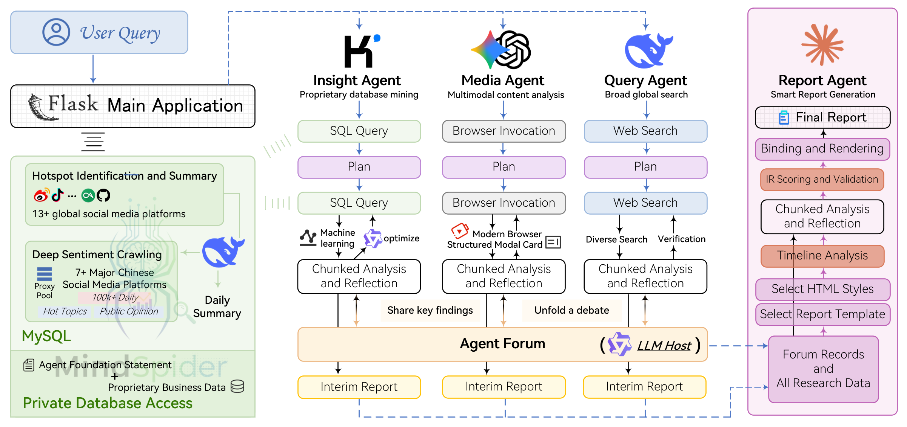

<div align="center">


<a href="https://trendshift.io/repositories/15286" target="_blank"></a>

<a href="https://aihubmix.com/?aff=8Ds9" target="_blank"></a>&ensp;
<a href="https://open.anspire.cn/?share_code=3E1FUOUH" target="_blank"></a>

[](https://github.com/666ghj/BettaFish/stargazers)
[](https://github.com/666ghj/BettaFish/watchers)
[](https://github.com/666ghj/BettaFish/network)
[](https://github.com/666ghj/BettaFish/issues)
[](https://github.com/666ghj/BettaFish/pulls)

[](https://github.com/666ghj/BettaFish/blob/main/LICENSE)
[](https://github.com/666ghj/BettaFish)
[](https://hub.docker.com/)


[English](./README-EN.md) | [涓枃鏂囨。](./README.md)

</div>

> [!IMPORTANT]  
> 鏌ョ湅鎴戜滑鏈€鏂板彂甯冪殑棰勬祴寮曟搸锛歔MiroFish-绠€娲侀€氱敤鐨勭兢浣撴櫤鑳藉紩鎿庯紝棰勬祴涓囩墿](https://github.com/666ghj/MiroFish)
> 
> 
>
> 鈥滄暟鎹垎鏋愪笁鏉挎枾鈥濆叏绾胯疮閫氾細鎴戜滑婵€鍔ㄧ殑瀹ｅ竷 MiroFish 姝ｅ紡鍙戝竷锛侀殢鐫€鏈€鍚庝竴鍧楃増鍥捐ˉ榻愶紝鎴戜滑鏋勫缓浜嗕粠 BettaFish锛堟暟鎹敹闆嗕笌鍒嗘瀽锛夊埌 MiroFish锛堝叏鏅娴嬶級鐨勫畬鏁撮摼璺€傝嚦姝わ紝浠庡師濮嬫暟鎹埌鏅鸿兘鍐崇瓥鐨勯棴鐜凡鎴愶紝璁╅瑙佹湭鏉ユ垚涓哄彲鑳斤紒

## 鈿?椤圭洰姒傝堪

> [!NOTE]
> 褰撳墠浠撳簱鐨勫澶栦富椤圭洰澹冲凡缁忓垏鎹㈠埌 `ClawRadar/` 鏍圭洰褰曪細椤跺眰涓诲寘涓?`clawradar/`锛屾寮忓惎鍔ㄥ叆鍙ｄ负 `run_openclaw_deliverable.py`銆傛湰鐩綍褰撳墠鍚嶄负 `radar_engines/`锛屽湪褰撳墠浠撳簱涓富瑕佷綔涓鸿澶嶇敤鐨勮兘鍔涘眰涓庡吋瀹瑰眰淇濈暀锛屽寘鎷?`MindSpider`銆乣QueryEngine`銆乣MediaEngine`銆乣ReportEngine` 绛夋ā鍧椼€?

鈥?*寰垎**鈥?鏄竴涓粠0瀹炵幇鐨勫垱鏂板瀷 澶氭櫤鑳戒綋 鑸嗘儏鍒嗘瀽绯荤粺锛屽府鍔╁ぇ瀹剁牬闄や俊鎭導鎴匡紝杩樺師鑸嗘儏鍘熻矊锛岄娴嬫湭鏉ヨ蛋鍚戯紝杈呭姪鍐崇瓥銆傜敤鎴峰彧闇€鍍忚亰澶╀竴鏍锋彁鍑哄垎鏋愰渶姹傦紝鏅鸿兘浣撳紑濮嬪叏鑷姩鍒嗘瀽 鍥藉唴澶?0+涓绘祦绀惧獟 涓?鏁扮櫨涓囨潯澶т紬璇勮銆?

> 鈥滃井鑸嗏€濊皭闊斥€滃井楸尖€濓紝BettaFish鏄竴绉嶄綋鍨嬪緢灏忎絾闈炲父濂芥枟銆佹紓浜殑楸硷紝瀹冭薄寰佺潃鈥滃皬鑰屽己澶э紝涓嶇晱鎸戞垬鈥?

鏌ョ湅绯荤粺浠モ€滄姹夊ぇ瀛﹁垎鎯呪€濅负渚嬶紝鐢熸垚鐨勭爺绌舵姤鍛婏細[姝︽眽澶у鍝佺墝澹拌獕娣卞害鍒嗘瀽鎶ュ憡](./outputs/final_reports/final_report__20250827_131630.html)

鏌ョ湅绯荤粺浠モ€滄姹夊ぇ瀛﹁垎鎯呪€濅负渚嬶紝涓€娆″畬鏁磋繍琛岀殑瑙嗛锛歔瑙嗛-姝︽眽澶у鍝佺墝澹拌獕娣卞害鍒嗘瀽鎶ュ憡](https://www.bilibili.com/video/BV1TH1WBxEWN/?vd_source=da3512187e242ce17dceee4c537ec7a6#reply279744466833)

涓嶄粎浠呬綋鐜板湪鎶ュ憡璐ㄩ噺涓婏紝鐩告瘮鍚岀被浜у搧锛屾垜浠嫢鏈夝煔€鍏ぇ浼樺娍锛?

1. **AI椹卞姩鐨勫叏鍩熺洃鎺?*锛欰I鐖櫕闆嗙兢7x24灏忔椂涓嶉棿鏂綔涓氾紝鍏ㄩ潰瑕嗙洊寰崥銆佸皬绾功銆佹姈闊炽€佸揩鎵嬬瓑10+鍥藉唴澶栧叧閿ぞ濯掋€備笉浠呭疄鏃舵崟鑾风儹鐐瑰唴瀹癸紝鏇磋兘涓嬮捇鑷虫捣閲忕敤鎴疯瘎璁猴紝璁╂偍鍚埌鏈€鐪熷疄銆佹渶骞挎硾鐨勫ぇ浼楀０闊炽€?

2. **瓒呰秺LLM鐨勫鍚堝垎鏋愬紩鎿?*锛氭垜浠笉浠呬緷璧栬璁＄殑5绫讳笓涓欰gent锛屾洿铻嶅悎浜嗗井璋冩ā鍨嬨€佺粺璁℃ā鍨嬬瓑涓棿浠躲€傞€氳繃澶氭ā鍨嬪崗鍚屽伐浣滐紝纭繚浜嗗垎鏋愮粨鏋滅殑娣卞害銆佸噯搴︿笌澶氱淮瑙嗚銆?

3. **寮哄ぇ鐨勫妯℃€佽兘鍔?*锛氱獊鐮村浘鏂囬檺鍒讹紝鑳芥繁搴﹁В鏋愭姈闊炽€佸揩鎵嬬瓑鐭棰戝唴瀹癸紝骞剁簿鍑嗘彁鍙栫幇浠ｆ悳绱㈠紩鎿庝腑鐨勫ぉ姘斻€佹棩鍘嗐€佽偂绁ㄧ瓑缁撴瀯鍖栧妯℃€佷俊鎭崱鐗囷紝璁╂偍鍏ㄩ潰鎺屾彙鑸嗘儏鍔ㄦ€併€?

4. **Agent鈥滆鍧涒€濆崗浣滄満鍒?*锛氫负涓嶅悓Agent璧嬩簣鐙壒鐨勫伐鍏烽泦涓庢€濈淮妯″紡锛屽紩鍏ヨ京璁轰富鎸佷汉妯″瀷锛岄€氳繃鈥滆鍧涒€濇満鍒惰繘琛岄摼寮忔€濈淮纰版挒涓庤京璁恒€傝繖涓嶄粎閬垮厤浜嗗崟涓€妯″瀷鐨勬€濈淮灞€闄愪笌浜ゆ祦瀵艰嚧鐨勫悓璐ㄥ寲锛屾洿鍌敓鍑烘洿楂樿川閲忕殑闆嗕綋鏅鸿兘涓庡喅绛栨敮鎸併€?

5. **鍏鍩熸暟鎹棤缂濊瀺鍚?*锛氬钩鍙颁笉浠呭垎鏋愬叕寮€鑸嗘儏锛岃繕鎻愪緵楂樺畨鍏ㄦ€х殑鎺ュ彛锛屾敮鎸佹偍灏嗗唴閮ㄤ笟鍔℃暟鎹簱涓庤垎鎯呮暟鎹棤缂濋泦鎴愩€傛墦閫氭暟鎹鍨掞紝涓哄瀭鐩翠笟鍔℃彁渚涒€滃閮ㄨ秼鍔?鍐呴儴娲炲療鈥濈殑寮哄ぇ鍒嗘瀽鑳藉姏銆?

6. **杞婚噺鍖栦笌楂樻墿灞曟€ф鏋?*锛氬熀浜庣函Python妯″潡鍖栬璁★紝瀹炵幇杞婚噺鍖栥€佷竴閿紡閮ㄧ讲銆備唬鐮佺粨鏋勬竻鏅帮紝寮€鍙戣€呭彲杞绘澗闆嗘垚鑷畾涔夋ā鍨嬩笌涓氬姟閫昏緫锛屽疄鐜板钩鍙扮殑蹇€熸墿灞曚笌娣卞害瀹氬埗銆?

**濮嬩簬鑸嗘儏锛岃€屼笉姝簬鑸嗘儏**銆傗€滃井鑸嗏€濈殑鐩爣锛屾槸鎴愪负椹卞姩涓€鍒囦笟鍔″満鏅殑绠€娲侀€氱敤鐨勬暟鎹垎鏋愬紩鎿庛€?

> 涓句釜渚嬪瓙. 浣犲彧闇€绠€鍗曚慨鏀笰gent宸ュ叿闆嗙殑api鍙傛暟涓巔rompt锛屽氨鍙互鎶婁粬鍙樻垚涓€涓噾铻嶉鍩熺殑甯傚満鍒嗘瀽绯荤粺
>
> 闄勪竴涓瘮杈冩椿璺冪殑L绔欓」鐩璁哄笘锛歨ttps://linux.do/t/topic/1009280
>
> 鏌ョ湅L绔欎浆鍙嬪仛鐨勬祴璇?[寮€婧愰」鐩?寰垎)涓巑anus|minimax|ChatGPT|Perplexity瀵规瘮](https://linux.do/t/topic/1148040)

<div align="center">


鍛婂埆浼犵粺鐨勬暟鎹湅鏉匡紝鍦ㄢ€滃井鑸嗏€濓紝涓€鍒囩敱涓€涓畝鍗曠殑闂寮€濮嬶紝鎮ㄥ彧闇€鍍忓璇濅竴鏍凤紝鎻愬嚭鎮ㄧ殑鍒嗘瀽闇€姹?
</div>

## 馃獎 璧炲姪鍟?

LLM妯″瀷API璧炲姪锛?a href="https://aihubmix.com/?aff=8Ds9" target="_blank"></a>

<details>
<summary>AI鑱旂綉鎼滅储銆佹枃浠惰В鏋愬強缃戦〉鍐呭鎶撳彇绛夋櫤鑳戒綋鏍稿績鑳藉姏鎻愪緵鍟嗭細</a><span style="margin-left: 10px"><a href="https://open.anspire.cn/?share_code=3E1FUOUH" target="_blank"></a></summary>
瀹夋€濇淳寮€鏀惧钩鍙?Anspire Open)鏄潰鍚戞櫤鑳戒綋鏃朵唬鐨勯鍏堢殑鍩虹璁炬柦鎻愪緵鍟嗐€傛垜浠负寮€鍙戣€呮彁渚涙瀯寤哄己澶ф櫤鑳戒綋鎵€闇€鐨勬牳蹇冭兘鍔涙爤锛岀幇宸蹭笂绾緼I鑱旂綉鎼滅储銆愬鐗堟湰锛屾瀬鍏风珵浜夊姏鐨勪环鏍笺€戙€佹枃浠惰В鏋愩€愰檺鍏嶃€戝強缃戦〉鍐呭鎶撳彇銆愰檺鍏嶃€戙€佷簯绔祻瑙堝櫒鑷姩鍖栵紙Anspire Browser Agent锛夈€愬唴娴嬨€戙€佸杞敼鍐欑瓑鏈嶅姟锛屾寔缁负鏅鸿兘浣撹繛鎺ュ苟鎿嶄綔澶嶆潅鐨勬暟瀛椾笘鐣屾彁渚涘潥瀹炲熀纭€銆傚彲鏃犵紳闆嗘垚鑷矰ify銆丆oze銆佸厓鍣ㄧ瓑涓绘祦鏅鸿兘浣撳钩鍙般€傞€氳繃閫忔槑鐐规暟璁¤垂浣撶郴涓庢ā鍧楀寲璁捐锛屼负浼佷笟鎻愪緵楂樻晥銆佷綆鎴愭湰鐨勫畾鍒跺寲鏀寔锛屽姞閫熸櫤鑳藉寲鍗囩骇杩涚▼銆?
</details>

## 馃彈锔?绯荤粺鏋舵瀯

### 鏁翠綋鏋舵瀯鍥?

**Insight Agent** 绉佹湁鏁版嵁搴撴寲鎺橈細绉佹湁鑸嗘儏鏁版嵁搴撴繁搴﹀垎鏋怉I浠ｇ悊

**Media Agent** 澶氭ā鎬佸唴瀹瑰垎鏋愶細鍏峰寮哄ぇ澶氭ā鎬佽兘鍔涚殑AI浠ｇ悊

**Query Agent** 绮惧噯淇℃伅鎼滅储锛氬叿澶囧浗鍐呭缃戦〉鎼滅储鑳藉姏鐨凙I浠ｇ悊

**Report Agent** 鏅鸿兘鎶ュ憡鐢熸垚锛氬唴缃ā鏉跨殑澶氳疆鎶ュ憡鐢熸垚AI浠ｇ悊

<div align="center">

</div>

### 涓€娆″畬鏁村垎鏋愭祦绋?

| 姝ラ | 闃舵鍚嶇О | 涓昏鎿嶄綔 | 鍙備笌缁勪欢 | 寰幆鐗规€?|
|------|----------|----------|----------|----------|
| 1 | 鐢ㄦ埛鎻愰棶 | Flask涓诲簲鐢ㄦ帴鏀舵煡璇?| Flask涓诲簲鐢?| - |
| 2 | 骞惰鍚姩 | 涓変釜Agent鍚屾椂寮€濮嬪伐浣?| Query Agent銆丮edia Agent銆両nsight Agent | - |
| 3 | 鍒濇鍒嗘瀽 | 鍚凙gent浣跨敤涓撳睘宸ュ叿杩涜姒傝鎼滅储 | 鍚凙gent + 涓撳睘宸ュ叿闆?| - |
| 4 | 绛栫暐鍒跺畾 | 鍩轰簬鍒濇缁撴灉鍒跺畾鍒嗗潡鐮旂┒绛栫暐 | 鍚凙gent鍐呴儴鍐崇瓥妯″潡 | - |
| 5-N | **寰幆闃舵** | **璁哄潧鍗忎綔 + 娣卞害鐮旂┒** | **ForumEngine + 鎵€鏈堿gent** | **澶氳疆寰幆** |
| 5.1 | 娣卞害鐮旂┒ | 鍚凙gent鍩轰簬璁哄潧涓绘寔浜哄紩瀵艰繘琛屼笓椤规悳绱?| 鍚凙gent + 鍙嶆€濇満鍒?+ 璁哄潧寮曞 | 姣忚疆寰幆 |
| 5.2 | 璁哄潧鍗忎綔 | ForumEngine鐩戞帶Agent鍙戣█骞剁敓鎴愪富鎸佷汉寮曞 | ForumEngine + LLM涓绘寔浜?| 姣忚疆寰幆 |
| 5.3 | 浜ゆ祦铻嶅悎 | 鍚凙gent鏍规嵁璁ㄨ璋冩暣鐮旂┒鏂瑰悜 | 鍚凙gent + forum_reader宸ュ叿 | 姣忚疆寰幆 |
| N+1 | 缁撴灉鏁村悎 | Report Agent鏀堕泦鎵€鏈夊垎鏋愮粨鏋滃拰璁哄潧鍐呭 | Report Agent | - |
| N+2 | IR涓棿琛ㄧず | 鍔ㄦ€侀€夋嫨妯℃澘鍜屾牱寮忥紝澶氳疆鐢熸垚鍏冩暟鎹紝瑁呰涓篒R涓棿琛ㄧず | Report Agent + 妯℃澘寮曟搸 | - |
| N+3 | 鎶ュ憡鐢熸垚 | 鍒嗗潡杩涜璐ㄩ噺妫€娴嬶紝鍩轰簬IR娓叉煋鎴愪氦浜掑紡 HTML 鎶ュ憡 | Report Agent + 瑁呰寮曟搸 | - |

### 椤圭洰浠ｇ爜缁撴瀯鏍?

```
BettaFish/
鈹溾攢鈹€ QueryEngine/                            # 鍥藉唴澶栨柊闂诲箍搴︽悳绱gent
鈹?  鈹溾攢鈹€ agent.py                            # Agent涓婚€昏緫锛屽崗璋冩悳绱笌鍒嗘瀽娴佺▼
鈹?  鈹溾攢鈹€ llms/                               # LLM鎺ュ彛灏佽
鈹?  鈹溾攢鈹€ nodes/                              # 澶勭悊鑺傜偣锛氭悳绱€佹牸寮忓寲銆佹€荤粨绛?
鈹?  鈹溾攢鈹€ tools/                              # 鍥藉唴澶栨柊闂绘悳绱㈠伐鍏烽泦
鈹?  鈹溾攢鈹€ utils/                              # 宸ュ叿鍑芥暟
鈹?  鈹溾攢鈹€ state/                              # 鐘舵€佺鐞?
鈹?  鈹溾攢鈹€ prompts/                            # 鎻愮ず璇嶆ā鏉?
鈹?  鈹斺攢鈹€ ...
鈹溾攢鈹€ MediaEngine/                            # 寮哄ぇ鐨勫妯℃€佺悊瑙gent
鈹?  鈹溾攢鈹€ agent.py                            # Agent涓婚€昏緫锛屽鐞嗚棰?鍥剧墖绛夊妯℃€佸唴瀹?
鈹?  鈹溾攢鈹€ llms/                               # LLM鎺ュ彛灏佽
鈹?  鈹溾攢鈹€ nodes/                              # 澶勭悊鑺傜偣锛氭悳绱€佹牸寮忓寲銆佹€荤粨绛?
鈹?  鈹溾攢鈹€ tools/                              # 澶氭ā鎬佹悳绱㈠伐鍏烽泦
鈹?  鈹溾攢鈹€ utils/                              # 宸ュ叿鍑芥暟
鈹?  鈹溾攢鈹€ state/                              # 鐘舵€佺鐞?
鈹?  鈹溾攢鈹€ prompts/                            # 鎻愮ず璇嶆ā鏉?
鈹?  鈹斺攢鈹€ ...
鈹溾攢鈹€ InsightEngine/                          # 绉佹湁鏁版嵁搴撴寲鎺楢gent
鈹?  鈹溾攢鈹€ agent.py                            # Agent涓婚€昏緫锛屽崗璋冩暟鎹簱鏌ヨ涓庡垎鏋?
鈹?  鈹溾攢鈹€ llms/                               # LLM鎺ュ彛灏佽
鈹?  鈹?  鈹斺攢鈹€ base.py                         # 缁熶竴鐨凮penAI鍏煎瀹㈡埛绔?
鈹?  鈹溾攢鈹€ nodes/                              # 澶勭悊鑺傜偣锛氭悳绱€佹牸寮忓寲銆佹€荤粨绛?
鈹?  鈹?  鈹溾攢鈹€ base_node.py                    # 鍩虹鑺傜偣绫?
鈹?  鈹?  鈹溾攢鈹€ search_node.py                  # 鎼滅储鑺傜偣
鈹?  鈹?  鈹溾攢鈹€ formatting_node.py              # 鏍煎紡鍖栬妭鐐?
鈹?  鈹?  鈹溾攢鈹€ report_structure_node.py        # 鎶ュ憡缁撴瀯鑺傜偣
鈹?  鈹?  鈹斺攢鈹€ summary_node.py                 # 鎬荤粨鑺傜偣
鈹?  鈹溾攢鈹€ tools/                              # 鏁版嵁搴撴煡璇㈠拰鍒嗘瀽宸ュ叿闆?
鈹?  鈹?  鈹溾攢鈹€ keyword_optimizer.py            # Qwen鍏抽敭璇嶄紭鍖栦腑闂翠欢
鈹?  鈹?  鈹溾攢鈹€ search.py                       # 鏁版嵁搴撴搷浣滃伐鍏烽泦锛堣瘽棰樻悳绱€佽瘎璁鸿幏鍙栫瓑锛?
鈹?  鈹?  鈹斺攢鈹€ sentiment_analyzer.py           # 鎯呮劅鍒嗘瀽闆嗘垚宸ュ叿
鈹?  鈹溾攢鈹€ utils/                              # 宸ュ叿鍑芥暟
鈹?  鈹?  鈹溾攢鈹€ config.py                       # 閰嶇疆绠＄悊
鈹?  鈹?  鈹溾攢鈹€ db.py                           # SQLAlchemy寮傛寮曟搸涓庡彧璇绘煡璇㈠皝瑁?
鈹?  鈹?  鈹斺攢鈹€ text_processing.py              # 鏂囨湰澶勭悊宸ュ叿
鈹?  鈹溾攢鈹€ state/                              # 鐘舵€佺鐞?
鈹?  鈹?  鈹斺攢鈹€ state.py                        # Agent鐘舵€佸畾涔?
鈹?  鈹溾攢鈹€ prompts/                            # 鎻愮ず璇嶆ā鏉?
鈹?  鈹?  鈹斺攢鈹€ prompts.py                      # 鍚勭被鎻愮ず璇?
鈹?  鈹斺攢鈹€ __init__.py
鈹溾攢鈹€ ReportEngine/                           # 澶氳疆鎶ュ憡鐢熸垚Agent
鈹?  鈹溾攢鈹€ agent.py                            # 鎬昏皟搴﹀櫒锛氭ā鏉块€夋嫨鈫掑竷灞€鈫掔瘒骞呪啋绔犺妭鈫掓覆鏌?
鈹?  鈹溾攢鈹€ flask_interface.py                  # Flask/SSE鍏ュ彛锛岀鐞嗕换鍔℃帓闃熶笌娴佸紡浜嬩欢
鈹?  鈹溾攢鈹€ llms/                               # OpenAI鍏煎LLM灏佽
鈹?  鈹?  鈹斺攢鈹€ base.py                         # 缁熶竴鐨勬祦寮?閲嶈瘯瀹㈡埛绔?
鈹?  鈹溾攢鈹€ core/                               # 鏍稿績鍔熻兘锛氭ā鏉胯В鏋愩€佺珷鑺傚瓨鍌ㄣ€佹枃妗ｈ璁?
鈹?  鈹?  鈹溾攢鈹€ template_parser.py              # Markdown妯℃澘鍒囩墖涓巗lug鐢熸垚
鈹?  鈹?  鈹溾攢鈹€ chapter_storage.py              # 绔犺妭run鐩綍銆乵anifest涓巖aw娴佸啓鍏?
鈹?  鈹?  鈹斺攢鈹€ stitcher.py                     # Document IR瑁呰鍣紝琛ラ綈閿氱偣/鍏冩暟鎹?
鈹?  鈹溾攢鈹€ ir/                                 # 鎶ュ憡涓棿琛ㄧず锛圛R锛夊绾︿笌鏍￠獙
鈹?  鈹?  鈹溾攢鈹€ schema.py                       # 鍧?鏍囪Schema甯搁噺瀹氫箟
鈹?  鈹?  鈹斺攢鈹€ validator.py                    # 绔犺妭JSON缁撴瀯鏍￠獙鍣?
鈹?  鈹溾攢鈹€ nodes/                              # 鍏ㄦ祦绋嬫帹鐞嗚妭鐐?
鈹?  鈹?  鈹溾攢鈹€ base_node.py                    # 鑺傜偣鍩虹被+鏃ュ織/鐘舵€侀挬瀛?
鈹?  鈹?  鈹溾攢鈹€ template_selection_node.py      # 妯℃澘鍊欓€夋敹闆嗕笌LLM绛涢€?
鈹?  鈹?  鈹溾攢鈹€ document_layout_node.py         # 鏍囬/鐩綍/涓婚璁捐
鈹?  鈹?  鈹溾攢鈹€ word_budget_node.py             # 绡囧箙瑙勫垝涓庣珷鑺傛寚浠ょ敓鎴?
鈹?  鈹?  鈹斺攢鈹€ chapter_generation_node.py      # 绔犺妭绾SON鐢熸垚+鏍￠獙
鈹?  鈹溾攢鈹€ prompts/                            # 鎻愮ず璇嶅簱涓嶴chema璇存槑
鈹?  鈹?  鈹斺攢鈹€ prompts.py                      # 妯℃澘閫夋嫨/甯冨眬/绡囧箙/绔犺妭鎻愮ず璇?
鈹?  鈹溾攢鈹€ renderers/                          # IR娓叉煋鍣?
鈹?  鈹?  鈹溾攢鈹€ html_renderer.py                # Document IR鈫掍氦浜掑紡HTML
鈹?  鈹?  鈹溾攢鈹€ pdf_renderer.py                 # HTML鈫扨DF瀵煎嚭锛圵easyPrint锛?
鈹?  鈹?  鈹溾攢鈹€ pdf_layout_optimizer.py         # PDF甯冨眬浼樺寲鍣?
鈹?  鈹?  鈹斺攢鈹€ chart_to_svg.py                 # 鍥捐〃杞琒VG宸ュ叿
鈹?  鈹溾攢鈹€ state/                              # 浠诲姟/鍏冩暟鎹姸鎬佹ā鍨?
鈹?  鈹?  鈹斺攢鈹€ state.py                        # ReportState涓庡簭鍒楀寲宸ュ叿
鈹?  鈹溾攢鈹€ utils/                              # 閰嶇疆涓庤緟鍔╁伐鍏?
鈹?  鈹?  鈹溾攢鈹€ config.py                       # Pydantic Settings涓庢墦鍗板姪鎵?
鈹?  鈹?  鈹溾攢鈹€ dependency_check.py             # 渚濊禆妫€鏌ュ伐鍏?
鈹?  鈹?  鈹溾攢鈹€ json_parser.py                  # JSON瑙ｆ瀽宸ュ叿
鈹?  鈹?  鈹溾攢鈹€ chart_validator.py              # 鍥捐〃鏍￠獙宸ュ叿
鈹?  鈹?  鈹斺攢鈹€ chart_repair_api.py             # 鍥捐〃淇API
鈹?  鈹溾攢鈹€ report_template/                    # Markdown妯℃澘搴?
鈹?  鈹?  鈹溾攢鈹€ 浼佷笟鍝佺墝澹拌獕鍒嗘瀽鎶ュ憡.md
鈹?  鈹?  鈹斺攢鈹€ ...
鈹?  鈹斺攢鈹€ __init__.py
鈹溾攢鈹€ ForumEngine/                            # 璁哄潧寮曟搸锛欰gent鍗忎綔鏈哄埗
鈹?  鈹溾攢鈹€ monitor.py                          # 鏃ュ織鐩戞帶鍜岃鍧涚鐞嗘牳蹇?
鈹?  鈹溾攢鈹€ llm_host.py                         # 璁哄潧涓绘寔浜篖LM妯″潡
鈹?  鈹斺攢鈹€ __init__.py
鈹溾攢鈹€ MindSpider/                             # 绀句氦濯掍綋鐖櫕绯荤粺
鈹?  鈹溾攢鈹€ main.py                             # 鐖櫕涓荤▼搴忓叆鍙?
鈹?  鈹溾攢鈹€ config.py                           # 鐖櫕閰嶇疆鏂囦欢
鈹?  鈹溾攢鈹€ BroadTopicExtraction/               # 璇濋鎻愬彇妯″潡
鈹?  鈹?  鈹溾攢鈹€ main.py                         # 璇濋鎻愬彇涓荤▼搴?
鈹?  鈹?  鈹溾攢鈹€ database_manager.py             # 鏁版嵁搴撶鐞嗗櫒
鈹?  鈹?  鈹溾攢鈹€ get_today_news.py               # 浠婃棩鏂伴椈鑾峰彇
鈹?  鈹?  鈹斺攢鈹€ topic_extractor.py              # 璇濋鎻愬彇鍣?
鈹?  鈹溾攢鈹€ DeepSentimentCrawling/              # 娣卞害鑸嗘儏鐖彇妯″潡
鈹?  鈹?  鈹溾攢鈹€ main.py                         # 娣卞害鐖彇涓荤▼搴?
鈹?  鈹?  鈹溾攢鈹€ keyword_manager.py              # 鍏抽敭璇嶇鐞嗗櫒
鈹?  鈹?  鈹溾攢鈹€ platform_crawler.py             # 骞冲彴鐖櫕绠＄悊
鈹?  鈹?  鈹斺攢鈹€ MediaCrawler/                   # 绀惧獟鐖櫕鏍稿績
鈹?  鈹?      鈹溾攢鈹€ main.py
鈹?  鈹?      鈹溾攢鈹€ config/                     # 鍚勫钩鍙伴厤缃?
鈹?  鈹?      鈹溾攢鈹€ media_platform/             # 鍚勫钩鍙扮埇铏疄鐜?
鈹?  鈹?      鈹斺攢鈹€ ...
鈹?  鈹斺攢鈹€ schema/                             # 鏁版嵁搴撶粨鏋勫畾涔?
鈹?      鈹溾攢鈹€ db_manager.py                   # 鏁版嵁搴撶鐞嗗櫒
鈹?      鈹溾攢鈹€ init_database.py                # 鏁版嵁搴撳垵濮嬪寲鑴氭湰
鈹?      鈹溾攢鈹€ mindspider_tables.sql           # 鏁版嵁搴撹〃缁撴瀯SQL
鈹?      鈹溾攢鈹€ models_bigdata.py               # 澶ц妯″獟浣撹垎鎯呰〃鐨凷QLAlchemy鏄犲皠
鈹?      鈹斺攢鈹€ models_sa.py                    # DailyTopic/Task绛夋墿灞曡〃ORM妯″瀷
鈹溾攢鈹€ SentimentAnalysisModel/                 # 鎯呮劅鍒嗘瀽妯″瀷闆嗗悎
鈹?  鈹溾攢鈹€ WeiboSentiment_Finetuned/           # 寰皟BERT/GPT-2妯″瀷
鈹?  鈹?  鈹溾攢鈹€ BertChinese-Lora/               # BERT涓枃LoRA寰皟
鈹?  鈹?  鈹?  鈹溾攢鈹€ train.py
鈹?  鈹?  鈹?  鈹溾攢鈹€ predict.py
鈹?  鈹?  鈹?  鈹斺攢鈹€ ...
鈹?  鈹?  鈹斺攢鈹€ GPT2-Lora/                      # GPT-2 LoRA寰皟
鈹?  鈹?      鈹溾攢鈹€ train.py
鈹?  鈹?      鈹溾攢鈹€ predict.py
鈹?  鈹?      鈹斺攢鈹€ ...
鈹?  鈹溾攢鈹€ WeiboMultilingualSentiment/         # 澶氳瑷€鎯呮劅鍒嗘瀽
鈹?  鈹?  鈹溾攢鈹€ train.py
鈹?  鈹?  鈹溾攢鈹€ predict.py
鈹?  鈹?  鈹斺攢鈹€ ...
鈹?  鈹溾攢鈹€ WeiboSentiment_SmallQwen/           # 灏忓弬鏁癚wen3寰皟
鈹?  鈹?  鈹溾攢鈹€ train.py
鈹?  鈹?  鈹溾攢鈹€ predict_universal.py
鈹?  鈹?  鈹斺攢鈹€ ...
鈹?  鈹斺攢鈹€ WeiboSentiment_MachineLearning/     # 浼犵粺鏈哄櫒瀛︿範鏂规硶
鈹?      鈹溾攢鈹€ train.py
鈹?      鈹溾攢鈹€ predict.py
鈹?      鈹斺攢鈹€ ...
鈹溾攢鈹€ SingleEngineApp/                        # 鍗曠嫭Agent鐨凷treamlit搴旂敤
鈹?  鈹溾攢鈹€ query_engine_streamlit_app.py       # QueryEngine鐙珛搴旂敤
鈹?  鈹溾攢鈹€ media_engine_streamlit_app.py       # MediaEngine鐙珛搴旂敤
鈹?  鈹斺攢鈹€ insight_engine_streamlit_app.py     # InsightEngine鐙珛搴旂敤
鈹溾攢鈹€ query_engine_streamlit_reports/         # QueryEngine鍗曞簲鐢ㄨ繍琛岃緭鍑?
鈹溾攢鈹€ media_engine_streamlit_reports/         # MediaEngine鍗曞簲鐢ㄨ繍琛岃緭鍑?
鈹溾攢鈹€ insight_engine_streamlit_reports/       # InsightEngine鍗曞簲鐢ㄨ繍琛岃緭鍑?
鈹溾攢鈹€ templates/                              # Flask鍓嶇妯℃澘
鈹?  鈹斺攢鈹€ index.html                          # 涓荤晫闈TML
鈹溾攢鈹€ static/                                 # 闈欐€佽祫婧?
鈹?  鈹溾攢鈹€ image/                              # 鍥剧墖璧勬簮
鈹?  鈹?  鈹斺攢鈹€ ...
鈹?  鈹溾攢鈹€ Partial README for PDF Exporting/   # PDF瀵煎嚭渚濊禆閰嶇疆璇存槑
鈹?  鈹斺攢鈹€ v2_report_example/                  # 鎶ュ憡娓叉煋绀轰緥
鈹?      鈹斺攢鈹€ report_all_blocks_demo/         # 鍏ㄥ潡绫诲瀷婕旂ず锛圚TML/PDF/MD锛?
鈹溾攢鈹€ outputs/                                # 缁熶竴杈撳嚭鐩綍
鈹?  鈹溾攢鈹€ logs/                               # 涓昏繍琛屾棩蹇椼€乫orum.log銆丷eportEngine鏃ュ織
鈹?  鈹斺攢鈹€ final_reports/                      # 鏈€缁堢敓鎴愮殑鎶ュ憡鏂囦欢
鈹?      鈹溾攢鈹€ ir/                             # 鎶ュ憡IR JSON鏂囦欢
鈹?      鈹斺攢鈹€ *.html                          # 鏈€缁圚TML鎶ュ憡
鈹溾攢鈹€ utils/                                  # 閫氱敤宸ュ叿鍑芥暟
鈹?  鈹溾攢鈹€ forum_reader.py                     # Agent闂磋鍧涢€氫俊宸ュ叿
鈹?  鈹溾攢鈹€ github_issues.py                    # 缁熶竴鐢熸垚GitHub Issue閾炬帴涓庨敊璇彁绀?
鈹?  鈹斺攢鈹€ retry_helper.py                     # 缃戠粶璇锋眰閲嶈瘯鏈哄埗宸ュ叿
鈹溾攢鈹€ tests/                                  # 鍗曞厓娴嬭瘯涓庨泦鎴愭祴璇?
鈹?  鈹溾攢鈹€ run_tests.py                        # pytest鍏ュ彛鑴氭湰
鈹?  鈹溾攢鈹€ test_monitor.py                     # ForumEngine鐩戞帶鍗曞厓娴嬭瘯
鈹?  鈹斺攢鈹€ ...
鈹溾攢鈹€ app.py                                  # Flask涓诲簲鐢ㄥ叆鍙?
鈹溾攢鈹€ config.py                               # 鍏ㄥ眬閰嶇疆鏂囦欢
鈹溾攢鈹€ ../.env.example                         # ClawRadar 浠撳簱鏍圭洰褰曠殑鐜鍙橀噺绀轰緥鏂囦欢
鈹溾攢鈹€ docker-compose.yml                      # Docker澶氭湇鍔＄紪鎺掗厤缃?
鈹溾攢鈹€ Dockerfile                              # Docker闀滃儚鏋勫缓鏂囦欢
鈹溾攢鈹€ ../requirements.txt                     # ClawRadar 浠撳簱鏍圭洰褰曠殑 Python 渚濊禆鍖呮竻鍗?
鈹溾攢鈹€ regenerate_latest_html.py               # 浣跨敤鏈€鏂扮珷鑺傞噸瑁呰骞舵覆鏌揌TML
鈹溾攢鈹€ regenerate_latest_md.py                 # 浣跨敤鏈€鏂扮珷鑺傞噸瑁呰骞舵覆鏌揗arkdown
鈹溾攢鈹€ regenerate_latest_pdf.py                # PDF閲嶆柊鐢熸垚宸ュ叿鑴氭湰
鈹溾攢鈹€ report_engine_only.py                   # Report Engine鍛戒护琛岀増鏈?
鈹溾攢鈹€ README.md                               # 涓枃璇存槑鏂囨。
鈹溾攢鈹€ README-EN.md                            # 鑻辨枃璇存槑鏂囨。
鈹溾攢鈹€ CONTRIBUTING.md                         # 涓枃璐＄尞鎸囧崡
鈹溾攢鈹€ CONTRIBUTING-EN.md                      # 鑻辨枃璐＄尞鎸囧崡
鈹斺攢鈹€ LICENSE                                 # GPL-2.0寮€婧愯鍙瘉
```

## 馃殌 蹇€熷紑濮嬶紙Docker锛?

> [!NOTE]
> 浠ヤ笅鍐呭鎻忚堪鐨勬槸 `radar_engines/` 瀛愮洰褰曡嚜韬殑鐙珛杩愯鏂瑰紡銆傚湪褰撳墠 ClawRadar 浠撳簱涓紝濡傛灉浣犺璧?OpenClaw 涓荤嚎锛岃浼樺厛浣跨敤浠撳簱鏍圭洰褰曠殑 `run_openclaw_deliverable.py` 涓庨《灞?`clawradar/`銆?

### 1. 鍚姩椤圭洰

澶嶅埗涓€浠介」鐩牴鐩綍 `.env.example` 鏂囦欢锛屽懡鍚嶄负 `.env` 锛屽苟鎸夐渶閰嶇疆 `.env` 鏂囦欢涓殑鐜鍙橀噺

鎵ц浠ヤ笅鍛戒护鍦ㄥ悗鍙板惎鍔ㄦ墍鏈夋湇鍔★細

```bash
docker compose up -d
```

> **娉細闀滃儚鎷夊彇閫熷害鎱?*锛屽湪鍘?`docker-compose.yml` 鏂囦欢涓紝鎴戜滑宸茬粡閫氳繃**娉ㄩ噴**鐨勬柟寮忔彁渚涗簡澶囩敤闀滃儚鍦板潃渚涙偍鏇挎崲

### 2. 閰嶇疆璇存槑

#### 鏁版嵁搴撻厤缃紙PostgreSQL锛?

璇锋寜鐓т互涓嬪弬鏁伴厤缃暟鎹簱杩炴帴淇℃伅锛屼篃鏀寔Mysql鍙嚜琛屼慨鏀癸細

| 閰嶇疆椤?| 濉啓鍊?| 璇存槑 |
| :--- | :--- | :--- |
| `DB_HOST` | `db` | 鏁版嵁搴撴湇鍔″悕绉?(瀵瑰簲 `docker-compose.yml` 涓殑鏈嶅姟鍚? |
| `DB_PORT` | `5432` | 榛樿 PostgreSQL 绔彛 |
| `DB_USER` | `bettafish` | 鏁版嵁搴撶敤鎴峰悕 |
| `DB_PASSWORD` | `bettafish` | 鏁版嵁搴撳瘑鐮?|
| `DB_NAME` | `bettafish` | 鏁版嵁搴撳悕绉?|
| **鍏朵粬** | **淇濇寔榛樿** | 鏁版嵁搴撹繛鎺ユ睜绛夊叾浠栧弬鏁拌淇濇寔榛樿璁剧疆銆?|

#### 澶фā鍨嬮厤缃?

> 鎴戜滑鎵€鏈?LLM 璋冪敤浣跨敤 OpenAI 鐨?API 鎺ュ彛鏍囧噯

鍦ㄥ畬鎴愭暟鎹簱閰嶇疆鍚庯紝璇锋甯搁厤缃?*鎵€鏈夊ぇ妯″瀷鐩稿叧鐨勫弬鏁?*锛岀‘淇濈郴缁熻兘澶熻繛鎺ュ埌鎮ㄩ€夋嫨鐨勫ぇ妯″瀷鏈嶅姟銆?

瀹屾垚涓婅堪鎵€鏈夐厤缃苟淇濆瓨鍚庯紝绯荤粺鍗冲彲姝ｅ父杩愯銆?

## 馃敡 婧愮爜鍚姩鎸囧崡

> 濡傛灉浣犳槸鍒濇瀛︿範涓€涓狝gent绯荤粺鐨勬惌寤猴紝鍙互浠庝竴涓潪甯哥畝鍗曠殑demo寮€濮嬶細[Deep Search Agent Demo](https://github.com/666ghj/DeepSearchAgent-Demo)

### 鐜瑕佹眰

- **鎿嶄綔绯荤粺**: Windows銆丩inux銆丮acOS
- **Python鐗堟湰**: 3.9+
- **Conda**: Anaconda鎴朚iniconda
- **鏁版嵁搴?*: PostgreSQL锛堟帹鑽愶級鎴朚ySQL
- **鍐呭瓨**: 寤鸿2GB浠ヤ笂

### 1. 鍒涘缓鐜

#### 濡傛灉浣跨敤Conda

```bash
# 鍒涘缓conda鐜
conda create -n your_conda_name python=3.11
conda activate your_conda_name
```

#### 濡傛灉浣跨敤uv

```bash
# 鍒涘缓uv鐜
uv venv --python 3.11 # 鍒涘缓3.11鐜
```

### 2. 瀹夎 PDF 瀵煎嚭鎵€闇€绯荤粺渚濊禆锛堝彲閫夛級

杩欓儴鍒嗘湁璇︾粏鐨勯厤缃鏄庯細[閰嶇疆鎵€闇€渚濊禆](./static/Partial%20README%20for%20PDF%20Exporting/README.md)

### 3. 瀹夎渚濊禆鍖?

> 濡傛灉璺宠繃浜嗘楠?锛寃easyprint搴撳彲鑳芥棤娉曞畨瑁咃紝PDF鍔熻兘鍙兘鏃犳硶姝ｅ父浣跨敤銆?

```bash
# 鍩虹渚濊禆瀹夎
pip install -r requirements.txt

# uv鐗堟湰鍛戒护锛堟洿蹇€熷畨瑁咃級
uv pip install -r requirements.txt
# 濡傛灉涓嶆兂浣跨敤鏈湴鎯呮劅鍒嗘瀽妯″瀷锛堢畻鍔涢渶姹傚緢灏忥紝榛樿瀹夎cpu鐗堟湰锛夛紝鍙互灏嗚鏂囦欢涓殑"鏈哄櫒瀛︿範"閮ㄥ垎娉ㄩ噴鎺夊啀鎵ц鎸囦护
```

### 4. 瀹夎Playwright娴忚鍣ㄩ┍鍔?

```bash
# 瀹夎娴忚鍣ㄩ┍鍔紙鐢ㄤ簬鐖櫕鍔熻兘锛?
playwright install chromium
```

### 5. 閰嶇疆LLM涓庢暟鎹簱

澶嶅埗涓€浠介」鐩牴鐩綍 `.env.example` 鏂囦欢锛屽懡鍚嶄负 `.env`

缂栬緫 `.env` 鏂囦欢锛屽～鍏ユ偍鐨凙PI瀵嗛挜锛堟偍涔熷彲浠ラ€夋嫨鑷繁鐨勬ā鍨嬨€佹悳绱唬鐞嗭紝璇︽儏瑙佹牴鐩綍.env.example鏂囦欢鍐呮垨鏍圭洰褰昪onfig.py涓殑璇存槑锛夛細

```yml
# ====================== 鏁版嵁搴撻厤缃?======================
# 鏁版嵁搴撲富鏈猴紝渚嬪localhost 鎴?127.0.0.1
DB_HOST=your_db_host
# 鏁版嵁搴撶鍙ｅ彿锛岄粯璁や负3306
DB_PORT=3306
# 鏁版嵁搴撶敤鎴峰悕
DB_USER=your_db_user
# 鏁版嵁搴撳瘑鐮?
DB_PASSWORD=your_db_password
# 鏁版嵁搴撳悕绉?
DB_NAME=your_db_name
# 鏁版嵁搴撳瓧绗﹂泦锛屾帹鑽恥tf8mb4锛屽吋瀹筫moji
DB_CHARSET=utf8mb4
# 鏁版嵁搴撶被鍨媝ostgresql鎴杕ysql
DB_DIALECT=postgresql
# 鏁版嵁搴撲笉闇€瑕佸垵濮嬪寲锛屾墽琛宎pp.py鏃朵細鑷姩妫€娴?

# ====================== LLM閰嶇疆 ======================
# 鎮ㄥ彲浠ユ洿鏀规瘡涓儴鍒哃LM浣跨敤鐨凙PI锛屽彧瑕佸吋瀹筄penAI璇锋眰鏍煎紡閮藉彲浠?
# 閰嶇疆鏂囦欢鍐呴儴缁欎簡姣忎竴涓狝gent鐨勬帹鑽怢LM锛屽垵娆￠儴缃茶鍏堝弬鑰冩帹鑽愯缃?

# Insight Agent
INSIGHT_ENGINE_API_KEY=
INSIGHT_ENGINE_BASE_URL=
INSIGHT_ENGINE_MODEL_NAME=

# Media Agent
...
```

### 6. 鍚姩绯荤粺

#### 6.1 瀹屾暣绯荤粺鍚姩锛堟帹鑽愶級

```bash
# 鍦ㄩ」鐩牴鐩綍涓嬶紝婵€娲籧onda鐜
conda activate your_conda_name

# 鍚姩涓诲簲鐢ㄥ嵆鍙?
python app.py
```

uv 鐗堟湰鍚姩鍛戒护 
```bash
# 鍦ㄩ」鐩牴鐩綍涓嬶紝婵€娲籾v鐜
.venv\Scripts\activate

# 鍚姩涓诲簲鐢ㄥ嵆鍙?
python app.py
```

> 娉?锛氫竴娆¤繍琛岀粓姝㈠悗锛宻treamlit app鍙兘缁撴潫寮傚父浠嶇劧鍗犵敤绔彛锛屾鏃舵悳绱㈠崰鐢ㄧ鍙ｇ殑杩涚▼kill鎺夊嵆鍙?

> 娉?锛氭暟鎹埇鍙栭渶瑕佸崟鐙搷浣滐紝瑙?.3鎸囧紩

璁块棶 http://localhost:5000 鍗冲彲浣跨敤瀹屾暣绯荤粺

#### 6.2 鍗曠嫭鍚姩鏌愪釜Agent

```bash
# 鍚姩QueryEngine
streamlit run SingleEngineApp/query_engine_streamlit_app.py --server.port 8503

# 鍚姩MediaEngine  
streamlit run SingleEngineApp/media_engine_streamlit_app.py --server.port 8502

# 鍚姩InsightEngine
streamlit run SingleEngineApp/insight_engine_streamlit_app.py --server.port 8501
```

#### 6.3 鐖櫕绯荤粺鍗曠嫭浣跨敤

杩欓儴鍒嗘湁璇︾粏鐨勯厤缃枃妗ｏ細[MindSpider浣跨敤璇存槑](./MindSpider/README.md)

<div align="center">


MindSpider 杩愯绀轰緥
</div>

```bash
# 杩涘叆鐖櫕鐩綍
cd MindSpider

# 椤圭洰鍒濆鍖?
python main.py --setup

# 杩愯璇濋鎻愬彇锛堣幏鍙栫儹鐐规柊闂诲拰鍏抽敭璇嶏級
python main.py --broad-topic

# 杩愯瀹屾暣鐖櫕娴佺▼
python main.py --complete --date 2024-01-20

# 浠呰繍琛岃瘽棰樻彁鍙?
python main.py --broad-topic --date 2024-01-20

# 浠呰繍琛屾繁搴︾埇鍙?
python main.py --deep-sentiment --platforms xhs dy wb
```

#### 6.4 鍛戒护琛屾姤鍛婄敓鎴愬伐鍏?

璇ュ伐鍏蜂細璺宠繃涓変釜鍒嗘瀽寮曟搸鐨勮繍琛岄樁娈碉紝鐩存帴璇诲彇瀹冧滑鐨勬渶鏂版棩蹇楁枃浠讹紝骞跺湪鏃犻渶 Web 鐣岄潰鐨勬儏鍐典笅鐢熸垚缁煎悎鎶ュ憡锛堝悓鏃剁渷鐣ユ枃浠跺閲忔牎楠屾楠わ級锛岄粯璁や細鍦?PDF 涔嬪悗鑷姩鐢熸垚 Markdown锛堝彲鐢ㄥ弬鏁板叧闂級銆傞€氬父鐢ㄤ簬瀵规姤鍛婄敓鎴愮粨鏋滀笉婊℃剰銆侀渶瑕佸揩閫熼噸璇曠殑鍦烘櫙锛屾垨鍦ㄨ皟璇?Report Engine 鏃跺惎鐢ㄣ€?

```bash
# 鍩烘湰浣跨敤锛堣嚜鍔ㄤ粠鏂囦欢鍚嶆彁鍙栦富棰橈級
python report_engine_only.py

# 鎸囧畾鎶ュ憡涓婚
python report_engine_only.py --query "鍦熸湪宸ョ▼琛屼笟鍒嗘瀽"

# 璺宠繃PDF鐢熸垚锛堝嵆浣跨郴缁熸敮鎸侊級
python report_engine_only.py --skip-pdf

# 璺宠繃Markdown鐢熸垚
python report_engine_only.py --skip-markdown

# 鏄剧ず璇︾粏鏃ュ織
python report_engine_only.py --verbose

# 鏌ョ湅甯姪淇℃伅
python report_engine_only.py --help
```

**鍔熻兘璇存槑锛?*

1. **鑷姩妫€鏌ヤ緷璧?*锛氱▼搴忎細鑷姩妫€鏌DF鐢熸垚鎵€闇€鐨勭郴缁熶緷璧栵紝濡傛灉缂哄け浼氱粰鍑哄畨瑁呮彁绀?
2. **鑾峰彇鏈€鏂版枃浠?*锛氳嚜鍔ㄤ粠涓変釜寮曟搸鐩綍锛坄insight_engine_streamlit_reports`銆乣media_engine_streamlit_reports`銆乣query_engine_streamlit_reports`锛夎幏鍙栨渶鏂扮殑鍒嗘瀽鎶ュ憡
3. **鏂囦欢纭**锛氭樉绀烘墍鏈夐€夋嫨鐨勬枃浠跺悕銆佽矾寰勫拰淇敼鏃堕棿锛岀瓑寰呯敤鎴风‘璁わ紙榛樿杈撳叆 `y` 缁х画锛岃緭鍏?`n` 閫€鍑猴級
4. **鐩存帴鐢熸垚鎶ュ憡**锛氳烦杩囨枃浠跺鍔犲鏍哥▼搴忥紝鐩存帴璋冪敤Report Engine鐢熸垚缁煎悎鎶ュ憡
5. **鑷姩淇濆瓨鏂囦欢**锛?
   - HTML鎶ュ憡淇濆瓨鍒?`outputs/final_reports/` 鐩綍
   - PDF鎶ュ憡锛堝鏋滄湁渚濊禆锛変繚瀛樺埌 `outputs/final_reports/pdf/` 鐩綍
   - Markdown鎶ュ憡锛堝彲鐢?`--skip-markdown` 鍏抽棴锛変繚瀛樺埌 `outputs/final_reports/md/` 鐩綍
   - 鏂囦欢鍛藉悕鏍煎紡锛歚final_report_{涓婚}_{鏃堕棿鎴硙.html/pdf/md`

**娉ㄦ剰浜嬮」锛?*

- 纭繚涓変釜寮曟搸鐩綍涓嚦灏戞湁涓€涓寘鍚玚.md`鎶ュ憡鏂囦欢
- 鍛戒护琛屽伐鍏蜂笌Web鐣岄潰鐩镐簰鐙珛锛屼笉浼氱浉浜掑奖鍝?
- 涓昏繍琛屾棩蹇椼€乣forum.log` 涓?ReportEngine 鏃ュ織榛樿缁熶竴鍐欏叆 `outputs/logs/`
- PDF鐢熸垚闇€瑕佸畨瑁呯郴缁熶緷璧栵紝璇﹁涓婃枃"瀹夎 PDF 瀵煎嚭鎵€闇€绯荤粺渚濊禆"閮ㄥ垎

**蹇€熼噸娓叉煋鏈€鏂扮粨鏋滐細**

- `regenerate_latest_html.py` / `regenerate_latest_md.py`锛氫粠 `CHAPTER_OUTPUT_DIR` 涓渶鏂颁竴娆¤繍琛岀殑绔犺妭 JSON 閲嶈璁?Document IR锛屽苟鐩存帴娓叉煋 HTML 鎴?Markdown銆?
- `regenerate_latest_pdf.py`锛氳鍙?`outputs/final_reports/ir` 閲屾渶鏂扮殑 IR锛屼娇鐢?SVG 鐭㈤噺鍥捐〃閲嶆柊瀵煎嚭 PDF銆?

## 鈿欙笍 楂樼骇閰嶇疆锛堝凡杩囨椂锛屽凡缁忕粺涓€涓洪」鐩牴鐩綍.env鏂囦欢绠＄悊锛屽叾浠栧瓙agent鑷姩缁ф壙鏍圭洰褰曢厤缃級

### 淇敼鍏抽敭鍙傛暟

#### Agent閰嶇疆鍙傛暟

姣忎釜Agent閮芥湁涓撻棬鐨勯厤缃枃浠讹紝鍙牴鎹渶姹傝皟鏁达紝涓嬮潰鏄儴鍒嗙ず渚嬶細

```python
# QueryEngine/utils/config.py
class Config:
    max_reflections = 2           # 鍙嶆€濊疆娆?
    max_search_results = 15       # 鏈€澶ф悳绱㈢粨鏋滄暟
    max_content_length = 8000     # 鏈€澶у唴瀹归暱搴?
    
# MediaEngine/utils/config.py  
class Config:
    comprehensive_search_limit = 10  # 缁煎悎鎼滅储闄愬埗
    web_search_limit = 15           # 缃戦〉鎼滅储闄愬埗
    
# InsightEngine/utils/config.py
class Config:
    default_search_topic_globally_limit = 200    # 鍏ㄥ眬鎼滅储闄愬埗
    default_get_comments_limit = 500             # 璇勮鑾峰彇闄愬埗
    max_search_results_for_llm = 50              # 浼犵粰LLM鐨勬渶澶х粨鏋滄暟
```

#### 鎯呮劅鍒嗘瀽妯″瀷閰嶇疆

```python
# InsightEngine/tools/sentiment_analyzer.py
SENTIMENT_CONFIG = {
    'model_type': 'multilingual',     # 鍙€? 'bert', 'multilingual', 'qwen'绛?
    'confidence_threshold': 0.8,      # 缃俊搴﹂槇鍊?
    'batch_size': 32,                 # 鎵瑰鐞嗗ぇ灏?
    'max_sequence_length': 512,       # 鏈€澶у簭鍒楅暱搴?
}
```

### 鎺ュ叆涓嶅悓鐨凩LM妯″瀷

鏀寔浠绘剰openAI璋冪敤鏍煎紡鐨凩LM鎻愪緵鍟嗭紝鍙渶瑕佸湪/config.py涓～鍐欏搴旂殑KEY銆丅ASE_URL銆丮ODEL_NAME鍗冲彲銆?

> 浠€涔堟槸openAI璋冪敤鏍煎紡锛熶笅闈㈡彁渚涗竴涓畝鍗曠殑渚嬪瓙锛?
>```python
>from openai import OpenAI
>
>client = OpenAI(api_key="your_api_key", 
>                base_url="https://aihubmix.com/v1")
>
>response = client.chat.completions.create(
>    model="gpt-4o-mini",
>    messages=[
>        {'role': 'user', 
>         'content': "鎺ㄧ悊妯″瀷浼氱粰甯傚満甯︽潵鍝簺鏂扮殑鏈轰細"}
>    ],
>)
>
>complete_response = response.choices[0].message.content
>print(complete_response)
>```

### 鏇存敼鎯呮劅鍒嗘瀽妯″瀷

绯荤粺闆嗘垚浜嗗绉嶆儏鎰熷垎鏋愭柟娉曪紝鍙牴鎹渶姹傞€夋嫨锛?

#### 1. 澶氳瑷€鎯呮劅鍒嗘瀽

```bash
cd SentimentAnalysisModel/WeiboMultilingualSentiment
python predict.py --text "This product is amazing!" --lang "en"
```

#### 2. 灏忓弬鏁癚wen3寰皟

```bash
cd SentimentAnalysisModel/WeiboSentiment_SmallQwen
python predict_universal.py --text "杩欐娲诲姩鍔炲緱寰堟垚鍔?
```

#### 3. 鍩轰簬BERT鐨勫井璋冩ā鍨?

```bash
# 浣跨敤BERT涓枃妯″瀷
cd SentimentAnalysisModel/WeiboSentiment_Finetuned/BertChinese-Lora
python predict.py --text "杩欎釜浜у搧鐪熺殑寰堜笉閿?
```

#### 4. GPT-2 LoRA寰皟妯″瀷

```bash
cd SentimentAnalysisModel/WeiboSentiment_Finetuned/GPT2-Lora
python predict.py --text "浠婂ぉ蹇冩儏涓嶅お濂?
```

#### 5. 浼犵粺鏈哄櫒瀛︿範鏂规硶

```bash
cd SentimentAnalysisModel/WeiboSentiment_MachineLearning
python predict.py --model_type "svm" --text "鏈嶅姟鎬佸害闇€瑕佹敼杩?
```

### 鎺ュ叆鑷畾涔変笟鍔℃暟鎹簱

#### 1. 淇敼鏁版嵁搴撹繛鎺ラ厤缃?

```python
# config.py 涓坊鍔犳偍鐨勪笟鍔℃暟鎹簱閰嶇疆
BUSINESS_DB_HOST = "your_business_db_host"
BUSINESS_DB_PORT = 3306
BUSINESS_DB_USER = "your_business_user"
BUSINESS_DB_PASSWORD = "your_business_password"
BUSINESS_DB_NAME = "your_business_database"
```

#### 2. 鍒涘缓鑷畾涔夋暟鎹闂伐鍏?

```python
# InsightEngine/tools/custom_db_tool.py
class CustomBusinessDBTool:
    """鑷畾涔変笟鍔℃暟鎹簱鏌ヨ宸ュ叿"""
    
    def __init__(self):
        self.connection_config = {
            'host': config.BUSINESS_DB_HOST,
            'port': config.BUSINESS_DB_PORT,
            'user': config.BUSINESS_DB_USER,
            'password': config.BUSINESS_DB_PASSWORD,
            'database': config.BUSINESS_DB_NAME,
        }
    
    def search_business_data(self, query: str, table: str):
        """鏌ヨ涓氬姟鏁版嵁"""
        # 瀹炵幇鎮ㄧ殑涓氬姟閫昏緫
        pass
    
    def get_customer_feedback(self, product_id: str):
        """鑾峰彇瀹㈡埛鍙嶉鏁版嵁"""
        # 瀹炵幇瀹㈡埛鍙嶉鏌ヨ閫昏緫
        pass
```

#### 3. 闆嗘垚鍒癐nsightEngine

```python
# InsightEngine/agent.py 涓泦鎴愯嚜瀹氫箟宸ュ叿
from .tools.custom_db_tool import CustomBusinessDBTool

class DeepSearchAgent:
    def __init__(self, config=None):
        # ... 鍏朵粬鍒濆鍖栦唬鐮?
        self.custom_db_tool = CustomBusinessDBTool()
    
    def execute_custom_search(self, query: str):
        """鎵ц鑷畾涔変笟鍔℃暟鎹悳绱?""
        return self.custom_db_tool.search_business_data(query, "your_table")
```

### 鑷畾涔夋姤鍛婃ā鏉?

#### 1. 鍦╓eb鐣岄潰涓笂浼?

绯荤粺鏀寔涓婁紶鑷畾涔夋ā鏉挎枃浠讹紙.md鎴?txt鏍煎紡锛夛紝鍙湪鐢熸垚鎶ュ憡鏃堕€夋嫨浣跨敤銆?

#### 2. 鍒涘缓妯℃澘鏂囦欢

鍦?`ReportEngine/report_template/` 鐩綍涓嬪垱寤烘柊鐨勬ā鏉匡紝鎴戜滑鐨凙gent浼氳嚜琛岄€夌敤鏈€鍚堥€傜殑妯℃澘銆?

## 馃 璐＄尞鎸囧崡

鎴戜滑娆㈣繋鎵€鏈夊舰寮忕殑璐＄尞锛?

**璇烽槄璇讳互涓嬭础鐚寚鍗楋細**  
- [CONTRIBUTING.md](./CONTRIBUTING.md)

## 馃 涓嬩竴姝ュ紑鍙戣鍒?

鐜板湪绯荤粺瀹屾垚浜嗘渶鍚庝竴姝ラ娴嬶紒璁块棶鏌ョ湅銆怣iroFish-棰勬祴涓囩墿銆戯細https://github.com/666ghj/MiroFish

<div align="center">


</div>

## 鈿狅笍 鍏嶈矗澹版槑

**閲嶈鎻愰啋锛氭湰椤圭洰浠呬緵瀛︿範銆佸鏈爺绌跺拰鏁欒偛鐩殑浣跨敤**

1. **鍚堣鎬у０鏄?*锛?
   - 鏈」鐩腑鐨勬墍鏈変唬鐮併€佸伐鍏峰拰鍔熻兘鍧囦粎渚涘涔犮€佸鏈爺绌跺拰鏁欒偛鐩殑浣跨敤
   - 涓ョ灏嗘湰椤圭洰鐢ㄤ簬浠讳綍鍟嗕笟鐢ㄩ€旀垨鐩堝埄鎬ф椿鍔?
   - 涓ョ灏嗘湰椤圭洰鐢ㄤ簬浠讳綍杩濇硶銆佽繚瑙勬垨渚电姱浠栦汉鏉冪泭鐨勮涓?

2. **鐖櫕鍔熻兘鍏嶈矗**锛?
   - 椤圭洰涓殑鐖櫕鍔熻兘浠呯敤浜庢妧鏈涔犲拰鐮旂┒鐩殑
   - 浣跨敤鑰呭繀椤婚伒瀹堢洰鏍囩綉绔欑殑robots.txt鍗忚鍜屼娇鐢ㄦ潯娆?
   - 浣跨敤鑰呭繀椤婚伒瀹堢浉鍏虫硶寰嬫硶瑙勶紝涓嶅緱杩涜鎭舵剰鐖彇鎴栨暟鎹互鐢?
   - 鍥犱娇鐢ㄧ埇铏姛鑳戒骇鐢熺殑浠讳綍娉曞緥鍚庢灉鐢变娇鐢ㄨ€呰嚜琛屾壙鎷?

3. **鏁版嵁浣跨敤鍏嶈矗**锛?
   - 椤圭洰娑夊強鐨勬暟鎹垎鏋愬姛鑳戒粎渚涘鏈爺绌朵娇鐢?
   - 涓ョ灏嗗垎鏋愮粨鏋滅敤浜庡晢涓氬喅绛栨垨鐩堝埄鐩殑
   - 浣跨敤鑰呭簲纭繚鎵€鍒嗘瀽鏁版嵁鐨勫悎娉曟€у拰鍚堣鎬?

4. **鎶€鏈厤璐?*锛?
   - 鏈」鐩寜"鐜扮姸"鎻愪緵锛屼笉鎻愪緵浠讳綍鏄庣ず鎴栨殫绀虹殑淇濊瘉
   - 浣滆€呬笉瀵逛娇鐢ㄦ湰椤圭洰閫犳垚鐨勪换浣曠洿鎺ユ垨闂存帴鎹熷け鎵挎媴璐ｄ换
   - 浣跨敤鑰呭簲鑷璇勪及椤圭洰鐨勯€傜敤鎬у拰椋庨櫓

5. **璐ｄ换闄愬埗**锛?
   - 浣跨敤鑰呭湪浣跨敤鏈」鐩墠搴斿厖鍒嗕簡瑙ｇ浉鍏虫硶寰嬫硶瑙?
   - 浣跨敤鑰呭簲纭繚鍏朵娇鐢ㄨ涓虹鍚堝綋鍦版硶寰嬫硶瑙勮姹?
   - 鍥犺繚鍙嶆硶寰嬫硶瑙勪娇鐢ㄦ湰椤圭洰鑰屼骇鐢熺殑浠讳綍鍚庢灉鐢变娇鐢ㄨ€呰嚜琛屾壙鎷?

**璇峰湪浣跨敤鏈」鐩墠浠旂粏闃呰骞剁悊瑙ｄ笂杩板厤璐ｅ０鏄庛€備娇鐢ㄦ湰椤圭洰鍗宠〃绀烘偍宸插悓鎰忓苟鎺ュ彈涓婅堪鎵€鏈夋潯娆俱€?*

## 馃搫 璁稿彲璇?

鏈」鐩噰鐢?[GPL-2.0璁稿彲璇乚(LICENSE)銆傝缁嗕俊鎭鍙傞槄LICENSE鏂囦欢銆?

## 馃帀 鏀寔涓庤仈绯?

### 鑾峰彇甯姪

甯歌闂瑙ｇ瓟锛歨ttps://github.com/666ghj/BettaFish/issues/185

- **椤圭洰涓婚〉**锛歔GitHub浠撳簱](https://github.com/666ghj/BettaFish)
- **闂鍙嶉**锛歔Issues椤甸潰](https://github.com/666ghj/BettaFish/issues)
- **鍔熻兘寤鸿**锛歔Discussions椤甸潰](https://github.com/666ghj/BettaFish/discussions)

### 鑱旂郴鏂瑰紡

- 馃摟 **閭**锛歨angjiang@bupt.edu.cn

### 鍟嗗姟鍚堜綔

- **浼佷笟瀹氬埗寮€鍙?*
- **澶ф暟鎹湇鍔?*
- **瀛︽湳鍚堜綔**
- **鎶€鏈煿璁?*

## 馃懃 璐＄尞鑰?

鎰熻阿浠ヤ笅浼樼鐨勮础鐚€呬滑锛?

[](https://github.com/666ghj/BettaFish/graphs/contributors)

## 馃専 鍔犲叆瀹樻柟浜ゆ祦缇?

<div align="center">
  
  
</div>

## 馃搱 椤圭洰缁熻

<a href="https://www.star-history.com/#666ghj/BettaFish&type=date&legend=top-left">
 <picture>
   <source media="(prefers-color-scheme: dark)" srcset="https://api.star-history.com/svg?repos=666ghj/BettaFish&type=date&theme=dark&legend=top-left" />
   <source media="(prefers-color-scheme: light)" srcset="https://api.star-history.com/svg?repos=666ghj/BettaFish&type=date&legend=top-left" />
   
 </picture>
</a>


